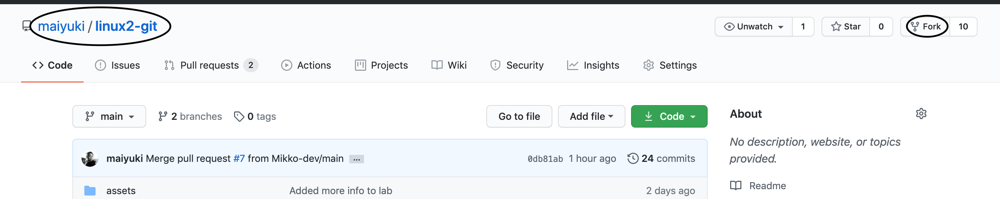
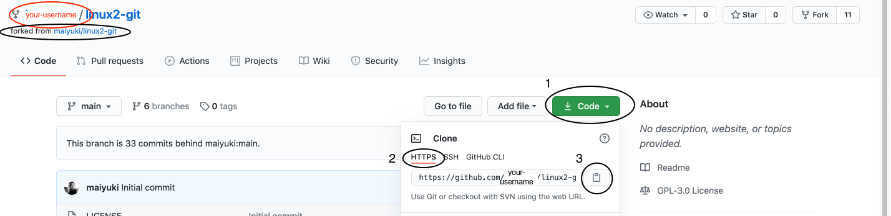
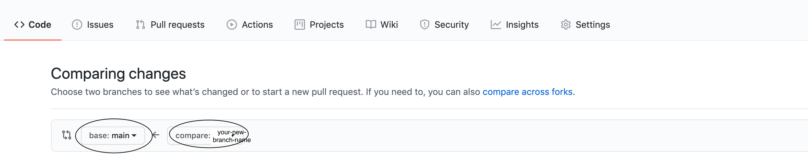

# Lab - Git

## Description

This is an individual lab in a group. You do the labs on your local machine and help each other.

## Prerequisites

Account in Github
git

## Objectives

- Make a pull request on a repository in Github

## Software

Github
git

## TODO

#### Create a Github account

- Create a Github account

[Guide to creating Github account](https://www.wikihow.com/Create-an-Account-on-GitHub)


#### Fork this repository `https://github.com/maiyuki/linux2-git`

- Visit `https://github.com/maiyuki/linux2-git` in your web browser
- Do a fork and wait a few seconds until it is done.. (See the Notes below about Fork)
- Visit the forked repository in your GitHub account `https://github.com/<your-username>/linux2-git` and you should see that you have a copy of `linux2-git`repository in your Github account.

#### Clone YOUR repository, create a branch, add file and push to your repository

- Clone this repository from YOUR Github account to your local machine
- In your terminal, checkout to a new branch
- Add a file in the directory `linux2-git/2-pull-request//`
- Add file to index
- Make a commit
- Make a push (which is in your Github account)
- (a message on the terminal will pop up:)

```bash
fatal: The current branch <your-new-branch-name> has no upstream branch.
To push the current branch and set the remote as upstream, use

    git push --set-upstream origin <your-new-branch-name>
```

- Set remote as upstream

#### Make a pull request to `https://github.com/maiyuki/linux2-git` repository

- Go immediately to `https://github.com/<your-username>/linux2-git` after you have made a push and press the green button `Compare & pull` (it disappears after a while)
- In the `Comparing changes` stage. Make sure that `compare:<your-new-branch-name>` is merging to `base:main`. Create a pull request.
- Merge into master/main branch
- Go back to your repository (`https://github.com/<your-username>/linux2-git`) Do a `Pull request` and that will create a pull request to `https://github.com/maiyuki/linux2-git`
- Wait for approval..

### Basic git commands (hints)

```bash
git init
git status
git commit
git checkout
git add
git diff
git branch
git merge
git push # this is a new command for this lab
git reset
git help
```

---

## Answers

#### Fork this repository `https://github.com/maiyuki/linux2-git`

- Visit `https://github.com/maiyuki/linux2-git` in your web browser

- Do a fork and wait a few seconds until it is done.. (See the Notes below about Fork)



- Visit the forked repository in your GitHub account `https://github.com/<your-username>/linux2-git` and you should see that you have a copy of `linux2-git`repository in your Github account.



#### Clone YOUR repository, create a branch, add file and push to your repository

- Clone this repository from YOUR Github account to your local machine


```bash
git clone https://github.com/<your-username>/linux2-git
```

- In your terminal, checkout to a new branch

```bash
git checkout -b <your-new-branch-name>
```

- Add a file in the directory `linux2-git/2-pull-request/ADD-YOUR-FILE-HERE/`

```bash
touch hello-world.txt
```

- Add file to index

```bash
git add .
```

- Make a commit

```bash
git commit -m "My hello world file"
```

- Make a push (which is in your Github account)

```bash
git push
```

- (a message on the terminal will pop up:)

```bash
fatal: The current branch <your-new-branch-name> has no upstream branch.
To push the current branch and set the remote as upstream, use

    git push --set-upstream origin <your-new-branch-name>
```

- Set remote as upstream

```bash
git push --set-upstream origin <your-new-branch-name>
```

#### Make a pull request to `https://github.com/maiyuki/linux2-git` repository

- Go immediately to `https://github.com/<your-username>/linux2-git` after you have made a push and press the green button `Compare & pull` (it disappears after a while)


- In the `Comparing changes` stage. Make sure that `compare:<your-new-branch-name>` is merging to `base:main`. Create a pull request.



- Merge into master/main branch
        - click on merge button

- Go back to your repository (`https://github.com/<your-username>/linux2-git`) Do a `Pull request` and that will create a pull request to `https://github.com/maiyuki/linux2-git`


- Wait for approval.. (you are done)

## Notes

Fork: When you are working in your project groups. You should not use a fork. Just clone from the group's repository. The fork is only for the lab to work.
